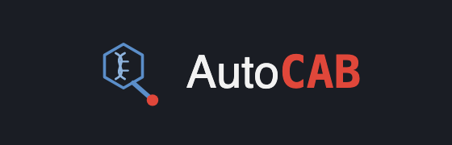
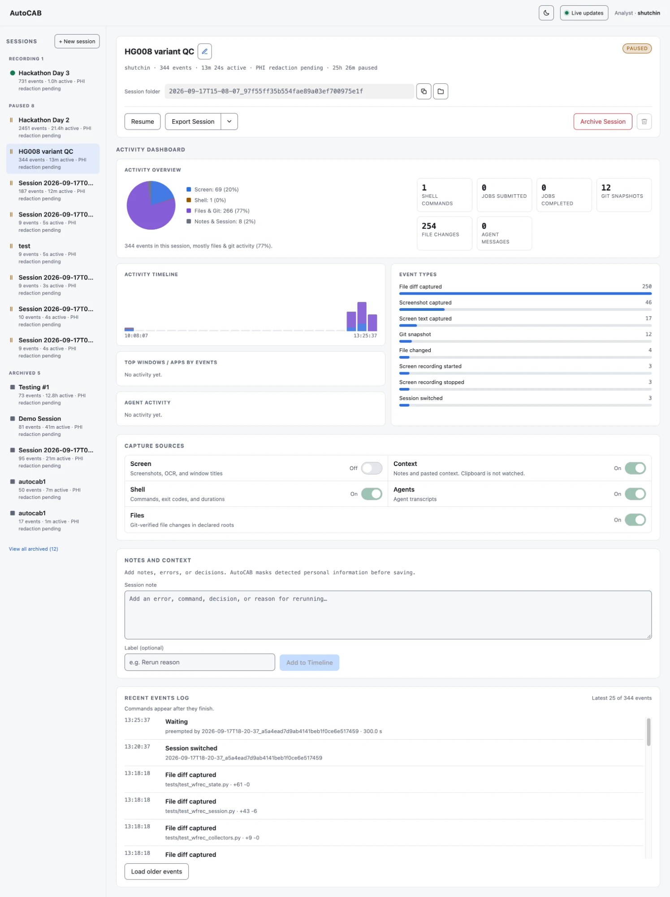

[](LICENSE.md)
[](pyproject.toml)
[](https://github.com/stjude-biohackathon/KIDS26-Team6/actions/workflows/tests.yml)
[](docs/recording.md)

AutoCAB records computational work and turns sealed sessions into
evidence-linked agent skill drafts. Analysts review, edit, and explicitly
approve every draft before AutoCAB packages it as a reusable skill.

The project connects three parts of the workflow:

- **Recording** captures shell commands, screen activity, notes, agent
  transcripts, and file changes.
- **PHI redaction** applies pattern matching during capture and can add a local
  GLiNER model when a session is sealed.
- **Skill Forge** links proposed instructions to recorded evidence and blocks
  packaging until a person resolves the review questions and approves the run.

The BioHackathon prototype is intended for public data, synthetic data, and
volunteer-consented sessions involving public data. Automated redaction can
miss PHI. Review exported files before sharing them.



## Workflow

```text
record -> seal -> forge -> review -> approve -> package
  |        |        |        |          |          |
events   redacted  blocked  validated  signed     skill
         session    draft    edits      decision   folder
```

AutoCAB stores recording sessions and Skill Forge runs separately. A sealed
session remains the evidence source for a forge run. Review and approval add
new records to that run without changing the original session.

| Stage | Command | Main result |
| --- | --- | --- |
| Initialize | `autocab init` | Local configuration, storage, and optional capture setup |
| Record | `autocab record start` | Append-only session evidence under `~/.autocab/sessions/` |
| Seal | `autocab record finish --seal` | Redacted session contents and an integrity record |
| Forge | `autocab forge --session <session-id>` | Blocked draft under `~/.autocab/runs/` |
| Review | `autocab review <run-id> ...` | Validated reviewer edits and open questions |
| Approve | `autocab approve <run-id> ...` | Explicit approval record |
| Package | `autocab package <run-id>` | Rendered and strictly validated skill folder |

Packaging does not publish the skill, push commits, or open a pull request.

## Quick Start

AutoCAB requires Python 3.10 or newer. Install
[`uv`](https://docs.astral.sh/uv/getting-started/installation/), create a local
environment, and install the project:

```bash
uv venv
source .venv/bin/activate
uv pip install -e '.[dev]'
```

Optional platform integrations are available through extras:

```bash
uv pip install -e '.[macos,dev]'  # macOS window titles and native OCR
uv pip install -e '.[linux,dev]'  # X11 and Wayland capture support
uv pip install -e '.[gui,dev]'    # optional native dashboard window
```

Run guided setup:

```bash
autocab init
```

Setup can save the analyst name, select a redaction engine, fetch explicitly
selected model weights, install shell hooks, copy legacy sessions, and run
readiness checks. Each system-changing action requires a flag or interactive
confirmation.

Record and seal a workflow:

```bash
autocab record start --title "HG008 variant QC" --watch .
autocab record note "Reran because the BAM was truncated" --label decision
autocab record pause --reason "Waiting on BWA" --expect 6h
autocab record resume
autocab record finish --seal
```

Create and review a skill draft:

```bash
autocab forge --session <session-id>
autocab review <run-id> \
  --reviewer "Analyst name" \
  --spec reviewed-skill-spec.json
autocab approve <run-id> --reviewer "Maintainer name"
autocab package <run-id>
autocab status
```

Before running `review`, copy the generated `skill-spec.json`, resolve its
blocking questions, and save the edited file as `reviewed-skill-spec.json`.
The draft remains blocked while required evidence or decisions are missing.

See the [integrated workflow guide](docs/integrated-workflow.md) for the state
model, stored artifacts, review rules, and recovery behavior.

## Dashboard

Start the local recorder and open the dashboard:

```bash
autocab dashboard
```

Without the optional native GUI dependency, AutoCAB opens the dashboard in the
system browser. On a headless or remote host, run
`autocab dashboard --no-open` and use an SSH tunnel or an explicitly enabled
remote bind. The `wfrec` command remains the compatibility interface for
recorder-specific controls and existing automation.

The dashboard and CLI read the same session and forge-run files. The dashboard
provides:

- recording state, session metadata, and provenance;
- source activity, a time-sorted activity timeline, and recent completed
  events;
- session renaming, workflow names, tags, notes, archiving, and local folder
  access;
- session exports with an additional local pattern-based redaction check; and
- the selected session's forge, review, approval, and packaging state.

The dashboard cannot bypass CLI validation or approval rules. See the
[recording guide](docs/recording.md#the-gui) for local, HPC, and remote access.

## PHI Redaction

Pattern-based redaction is enabled by default and requires no model download.
It runs during capture and establishes the minimum redaction layer used by the
supported model configurations.

Select and fetch the local GLiNER model during setup:

```bash
autocab init --redaction gliner --fetch-model
```

GLiNER2 PII requires its optional runtime:

```bash
uv pip install -e '.[deid-gliner2]'
autocab init --redaction gliner2-pii --fetch-model
```

Model weights are downloaded only after explicit selection and are stored in
`~/.autocab/models/` or `$AUTOCAB_HOME/models/`. They are not downloaded during
package installation. Interrupted downloads retain their resumable cache under
the same models directory. The configured engine runs when a session is sealed:

```bash
autocab record finish <session-id> --seal
```

Apply redaction to an already archived session with:

```bash
autocab record redact <session-id>
```

Use `--engine` to override the configured engine for one session. Missing or
unverified weights stop model-based sealing instead of silently changing the
redaction engine.

The committed evaluation uses 316 synthetic records with 572 labelled spans.
It measures complete span coverage and over-redaction for regex, GLiNER, and
GLiNER2 PII configurations. These results are regression evidence for the test
corpus. They are not a HIPAA Safe Harbor determination or validation on
external clinical text.

See the [de-identification evaluation](docs/deid-evaluation.md) for the figure,
scorecards, label-level results, benchmark commands, and limitations.

## Storage and Migration

AutoCAB keeps user data outside the repository:

| Path | Contents |
| --- | --- |
| `~/.autocab/config.toml` | Analyst and redaction defaults |
| `~/.autocab/state.json` | Current recorder state |
| `~/.autocab/sessions/<session-id>/` | Raw events, frames, diffs, notes, job logs, and seal records |
| `~/.autocab/runs/<run-id>/` | Forge evidence, specification, reviews, validation, and package |
| `~/.autocab/models/` | Explicitly downloaded local model weights |
| `~/.autocab/hooks/` | Installed shell capture hooks |

Existing sessions under `~/.wfrec/sessions/` remain discoverable for
compatibility. Copy them into canonical AutoCAB storage with:

```bash
autocab migrate --legacy
```

Migration verifies the copied files and leaves the original sessions in place.
Set `AUTOCAB_HOME` to use a different AutoCAB data directory.

## Recording Across Environments

Five evidence sources can be enabled independently:

| Source | Recorded evidence |
| --- | --- |
| `shell` | Commands, exit codes, and durations |
| `screen` | Changed frames, OCR text, and window titles |
| `context` | Notes deliberately added by the analyst |
| `agents` | Supported local agent transcripts |
| `files` | Git-verified changes under declared roots |

One session is active at a time. Starting or resuming another session pauses
the current session and records the handover in both timelines. Shell commands
appear after completion so their exit status and duration can be recorded.

Use `wfrec doctor` or `autocab init --check` to inspect capture readiness.
Recorder-specific commands support source toggles, SSH capture, Slurm log
collection, transcript attachment, and multi-session merging:

```bash
wfrec doctor
wfrec source screen on
wfrec ssh <host>
wfrec pull <host>
wfrec merge <session-id> <session-id> --output <folder>
```

The maintained `skills/setup-activity-tracking/` skill can verify and install
DevSQL and Atuin for local shell and agent activity. It shows the planned
system changes and waits for approval before installing hooks or dependencies.

Platform permissions, HPC setup, remote access, capture limits, and
troubleshooting are documented in [`docs/recording.md`](docs/recording.md).

## Skill Review and Packaging

Skill Forge starts from a sealed event snapshot. The initial draft records
observed commands, evidence links, unverified dependencies, and unresolved
questions about inputs and outputs. Missing procedure details remain explicit
questions for the reviewer.

A run progresses through these states:

```text
blocked -> needs_review -> approved -> packaged
```

- `review` validates edited skill specifications and reports remaining
  blockers.
- `approve` records a separate human decision after review.
- `package` renders the approved skill and applies strict package validation.

Every forge run preserves `evidence.json`, `skill-spec.json`, append-only
`reviews.jsonl`, and the current `run.json` state. Packaged runs also contain
`validation.json` and a `package/` directory.

The current tests establish that AutoCAB creates and validates evidence-linked
drafts. Evaluating whether a generated skill faithfully reproduces a recorded
scientific workflow requires independent execution and expert review.

## Compatibility Commands

The `wfrec` command remains available for advanced recorder controls and older
automation. AutoCAB also retains the original demonstration pipeline:

```bash
uv run autocab demo --help
uv run autocab ingest-terminal-log --help
```

Legacy demo proposals are written to `skills/generated-drafts/` by default.
New integrated work should use `record`, `forge`, `review`, `approve`, and
`package`.

## Development

Install the development dependencies, then run the project quality checks:

```bash
.venv/bin/python -m ruff check src tests
.venv/bin/python -m pytest
node --test tests/test_recording_dashboard.js
uv lock --check
```

Repository layout:

```text
src/autocab/       Unified CLI, recorder, dashboard, Skill Forge, and redaction
skills/            Agent skills and Skill Forge assets
docs/              Workflow, recording, evaluation, proposal, and team documents
data/              Sample workflow inputs and de-identification evaluation data
tests/             Python and JavaScript tests
```

## Documentation

- [Integrated AutoCAB workflow](docs/integrated-workflow.md)
- [Recording, platforms, and remote use](docs/recording.md)
- [PHI redaction evaluation](docs/deid-evaluation.md)
- [Project framework](docs/biohackathon-framework.md)
- [Challenge description](docs/proposal/AutoCAB-challenge-description.docx)
- [Architecture and platform rationale](docs/mgatta42/plan.md)

## Team

See [`docs/team/team_member_info.md`](docs/team/team_member_info.md) for the
project leads and team members.

## License

AutoCAB is licensed under the [MIT License](LICENSE.md).
