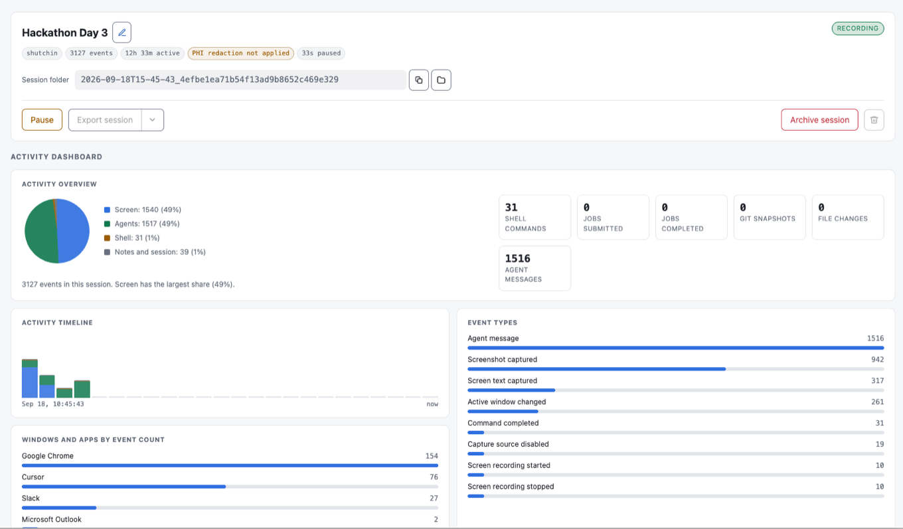

[](LICENSE.md)
[](pyproject.toml)
[](https://github.com/stjude-biohackathon/KIDS26-Team6/actions/workflows/tests.yml)
[](src/wfrec/README.md)

Recurring fixes, workarounds, and analysis steps often survive only in one
person's memory or terminal history. The next analyst must rediscover them.
AutoCAB records real work and turns recurring workflows into shared skills
that people review, edit, and approve before sharing.



## In this README

- [Quick start](#quick-start)
- [Record a workflow](#record-a-workflow)
- [Installation options](#installation-options)
- [Use other input formats](#use-other-input-formats)
- [How AutoCAB turns activity into skills](#how-autocab-turns-activity-into-skills)

## Quick start

AutoCAB requires Python 3.10 or newer. Install
[uv](https://docs.astral.sh/uv/getting-started/installation/), then run these
commands from the repository root:

```bash
uv venv
source .venv/bin/activate
uv pip install -e '.[dev]'
uv run autocab demo
```

The demo uses bundled synthetic workflow traces. A successful run prints a JSON
array of proposals and writes the skill packages to `skills/generated-drafts/`.

## What AutoCAB does

- AutoCAB normalizes and redacts workflow evidence, then compares it with
  existing skills before proposing a draft. A person must review, edit, and
  approve every draft before it becomes a shared skill.
- `wfrec` records on macOS, Linux, Windows, and HPC login nodes. You can enable
  each capture source independently.
- Regex rules redact detected sensitive text during capture. Optional
  model-based, Presidio, or LLM-gated checks can add another pass. `wfrec seal`
  applies redaction to an existing session before it is shared.
- The live dashboard shows session composition, activity over time, and event
  counts for windows and agents.
- A menu-bar or tray indicator and a floating badge remain visible while
  recording is active.
- SSH-based capture supports HPC work. Teams can open the dashboard remotely
  and merge sessions from multiple analysts.
- `skill-forge` turns incomplete activity records into validated skill
  packages linked to their source evidence. A person approves each package.

## Record a workflow

`wfrec` records live work and produces session artifacts for AutoCAB's input
adapters. Start by checking the available capture backends:

```bash
wfrec doctor
```

DevSQL with Atuin is the primary local shell backend. If `wfrec doctor` selects
`hook-spool`, install the fallback hook and confirm its status:

```bash
wfrec hooks install
wfrec hooks status
```

Record a session:

```bash
wfrec start --title "HG008 variant QC" --watch .
wfrec status
wfrec source screen on
wfrec note "reran because the BAM was truncated" --label why
wfrec pause --reason "waiting on bwa" --expect 6h
wfrec resume
wfrec stop
wfrec export
```

### Capture sources

| Source | Captures |
| --- | --- |
| `screen` | Frames, OCR text, and window titles |
| `context` | Text deliberately added through the paste box |
| `shell` | Commands, exit codes, and durations |
| `agents` | Codex, Claude Code, Copilot Chat, and Cursor transcripts |
| `files` | Git-verified changes in declared roots |

Source changes and pauses take effect in open terminals at the next prompt.
Only one session can be active. Starting or resuming another session pauses the
current one and records the handover in both timelines.

Local shell collection stores command metadata. Bounded Slurm output enters
through remote job-log collection.

### Session data and exports

Each session stores an append-only `events.jsonl` timeline. The session also
contains frames, diffs, notes, and job logs. `wfrec export` creates a complete
`events.json` document plus three **lossy** AutoCAB adapter formats.

The timeline remains the source of truth. Paused and archived sessions export
through a temporary, local, pattern-checked snapshot.

### Remote and team workflows

`wfrec ssh <host>` and `wfrec pull <host>` collect remote commands and Slurm
metadata. They also collect bounded slices from `slurm-*.out` through a POSIX
hook on the HPC login node.

For multiple analysts, use `wfrec merge`. You can also pass a directory of
session folders to `--session-dir` to combine sessions and distinguish repeated
workflows from one-off work.

## Installation options

### Install without uv

On HPC and shared Linux hosts, the default `python3` may be older than 3.10.
Create the environment with Python 3.10 or newer:

```bash
cd KIDS26-Team6
python3.11 -m venv .venv
source .venv/bin/activate
python -m pip install --upgrade pip setuptools wheel
pip install -e '.[linux,dev]'
python --version
```

The final command must report Python 3.10 or newer. If OCR fails with
`libGL.so.1`, reinstall the headless OpenCV package and run `wfrec doctor`:

```bash
pip install --force-reinstall opencv-python-headless
wfrec doctor
```

### Run on HPC

Do not use `wfrec daemon --gui` on a headless login node because `BROWSER` may
open a terminal browser. Start the daemon in the background instead:

```bash
nohup wfrec daemon >> ~/.wfrec/daemon.log 2>&1 &
```

The recorder guide explains how to
[open the dashboard from a cluster](src/wfrec/README.md#remote-browser-on-hpc-cluster-ip)
and [record with a background daemon](src/wfrec/README.md#hpc-background-daemon-and-recording).
It also covers SSH port forwarding, remote bind settings, shell hooks, and
shutdown.

### Set up activity tracking with Codex or Claude

The maintained skill in `skills/setup-activity-tracking/` helps Codex or Claude
verify and install DevSQL and Atuin. It configures Atuin for shell history.
Atuin hooks that attribute commands to agents remain optional because `wfrec`
reads Codex messages through DevSQL and reads Claude Code transcripts directly.
The agent shows its planned changes and waits for approval before changing the
system.

#### Codex

Ask Codex to install the skill from this repository:

```text
Use $skill-installer to install:
https://github.com/stjude-biohackathon/KIDS26-Team6/tree/main/skills/setup-activity-tracking
```

On the next turn, invoke the installed skill:

```text
$setup-activity-tracking verify and set up activity tracking
```

#### Claude Code

Ask Claude Code to copy `skills/setup-activity-tracking/` to
`~/.claude/skills/setup-activity-tracking/` while preserving an existing
installation. Then invoke the installed skill:

```text
/setup-activity-tracking verify and set up activity tracking
```

## Use other input formats

The repository includes runnable examples for trace and screen-capture inputs:

```bash
uv run autocab demo --input-mode trace --trace-file data/sample_workflow_traces.json
uv run autocab demo --input-mode screen-capture --capture-file data/sample_screen_capture.json
```

For your own terminal recording, replace `path/to/terminal-session.txt` with
the path to the log:

```bash
uv run autocab demo --input-mode terminal-log --log-file path/to/terminal-session.txt
```

Convert a terminal log into normalized trace JSON:

```bash
uv run autocab ingest-terminal-log path/to/terminal-session.txt --output /tmp/generated_terminal_trace.json
```

List recorded sessions with `wfrec sessions`, then replace `<id>` with the
session identifier:

```bash
uv run autocab demo --input-mode session --session-dir ~/.wfrec/sessions/<id>
```

## How AutoCAB turns activity into skills

Agent skills package the instructions, scripts, examples, and validation steps
needed for AI agents to repeat scientific workflows. CAB already publishes
these skills. Creating one requires maintainers to recognize a repeated
workflow, document it, test it, and contribute it to the shared library. Until
that happens, teams may repeat the same data preparation, quality control,
analysis, reporting, or troubleshooting work.

AutoCAB records workflow evidence and prepares a skill proposal for review.
People edit and approve each proposal before it becomes a shared skill.

```text
Workflow evidence
  -> normalize and cluster
  -> redact and compare with existing skills
  -> draft SKILL.md
  -> human review
  -> PR-ready skill folder
```

The BioHackathon prototype uses public or synthetic data. Recorded sessions
involve volunteers who consented to capture while working with public data.
`wfrec` provides the current recording layer. Input adapters can extend
collection to ActivityWatch, Screenpipe, and future activity sources.

See the [challenge description](docs/proposal/AutoCAB-challenge-description.docx)
and [framework documentation](docs/biohackathon-framework.md) for the project
rationale and architecture.

## Detailed documentation

Run `wfrec --help` for command help. Claude Code and Copilot users can also use
the `recorder` skill in `.claude/skills/recorder/`.

The [recorder guide](src/wfrec/README.md) covers platform setup, security,
capture sources, multi-analyst workflows, and troubleshooting. See the
[design plan](docs/mgatta42/plan.md) for the architecture and per-platform
backend matrix.

## Development and testing

Run the test suite from the repository-local environment:

```bash
.venv/bin/python -m pytest
```

## Repository layout

```text
src/autocab/       CLI, orchestration, pipeline framework, and de-identification engine
src/wfrec/         Cross-platform workflow recorder (the observation front end)
skills/            Agent skills, including skill-forge and setup-activity-tracking
docs/              Project documentation, proposal, and team information
data/              Sample inputs used by the prototype
tests/             Unit and pipeline tests
```

See [`src/wfrec/README.md`](src/wfrec/README.md) for the recorder's own layout
(collectors, exporters, hooks) in detail.

## Team

See [`docs/team/team_member_info.md`](docs/team/team_member_info.md) for the
project leads and team members.

## License

This project is licensed under the [MIT License](LICENSE.md).
