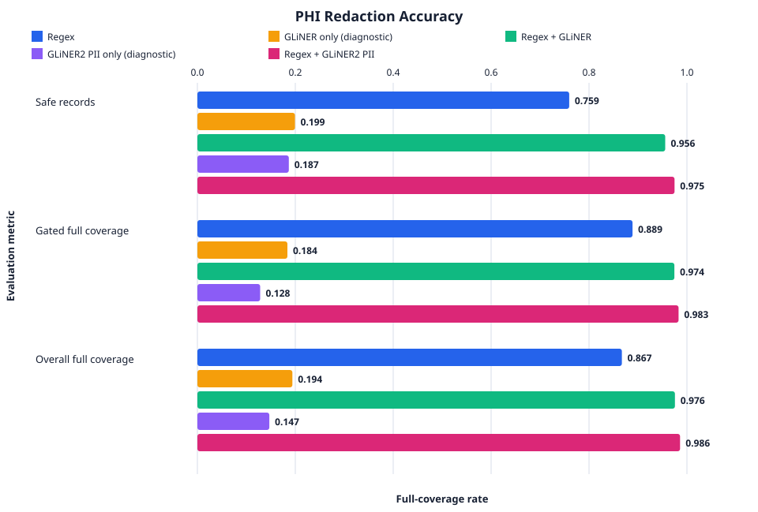

# De-identification evaluation

<!-- Generated from every data/deid-eval/scorecard.*.json snapshot. Do not hand-edit. -->

Corpus `ccfbf64eb85ed302` · 316 records · 572 gold spans



## Headline comparison

| Metric | Regex | GLiNER only (diagnostic) | Regex + GLiNER | GLiNER2 PII only (experimental) | Regex + GLiNER2 PII (experimental) |
| --- | ---: | ---: | ---: | ---: | ---: |
| Safe records | 0.7595 | 0.1994 | 0.9557 | 0.1867 | 0.9747 |
| Leaks per 1,000 records | 240.51 | 1458.86 | 44.30 | 1544.30 | 25.32 |
| Full-coverage recall, gated | 0.8889 | 0.1838 | 0.9744 | 0.1282 | 0.9829 |
| Full-coverage recall, all | 0.8671 | 0.1941 | 0.9755 | 0.1469 | 0.9860 |
| Over-redaction rate | 0.0043 | 0.0065 | 0.0055 | 0.0005 | 0.0048 |

Full-coverage recall counts a gold span only when every character is rewritten. Partial overlap remains a leak. The gated result uses the easy and medium tiers.
`Regex + GLiNER` is additive: the regex rules always run, then GLiNER adds contextual findings.
`GLiNER only` is a diagnostic evaluation mode. It is not available for production capture or sealing.
The GLiNER2 PII modes are experimental evaluation modes. They do not change the production sealing choices.
The tested GLiNER2 PII configuration requests only `person` at a 0.97 threshold. A local prompt and threshold sweep found that broader PII prompts increased false positives without improving the additive redaction result.

## Recall by label

| Label | Regex | GLiNER only (diagnostic) | Regex + GLiNER | GLiNER2 PII only (experimental) | Regex + GLiNER2 PII (experimental) |
| --- | ---: | ---: | ---: | ---: | ---: |
| `ACCESSION` | 1.0000 | 0.0000 | 1.0000 | 0.0000 | 1.0000 |
| `ACCOUNT` | 1.0000 | 0.0000 | 1.0000 | 0.0000 | 1.0000 |
| `AGE_OVER_89` | 1.0000 | 0.0000 | 1.0000 | 0.0000 | 1.0000 |
| `DATE_BARE` | 1.0000 | 0.1500 | 1.0000 | 0.0000 | 1.0000 |
| `DEVICE` | 1.0000 | 0.0000 | 1.0000 | 0.0000 | 1.0000 |
| `DOB_LABELLED` | 1.0000 | 0.2500 | 1.0000 | 0.0000 | 1.0000 |
| `EMAIL` | 1.0000 | 0.0000 | 1.0000 | 0.0938 | 1.0000 |
| `HEALTH_PLAN_ID` | 1.0000 | 0.0000 | 1.0000 | 0.0000 | 1.0000 |
| `IP` | 1.0000 | 0.0000 | 1.0000 | 0.0000 | 1.0000 |
| `LICENSE` | 1.0000 | 0.5000 | 1.0000 | 0.0000 | 1.0000 |
| `LOCATION` | 1.0000 | 0.3333 | 1.0000 | 0.0000 | 1.0000 |
| `MRN` | 1.0000 | 0.3750 | 1.0000 | 0.0000 | 1.0000 |
| `NAME` | 0.4500 | 0.5500 | 0.9500 | 0.5750 | 0.9500 |
| `PHONE` | 1.0000 | 0.1000 | 1.0000 | 0.0000 | 1.0000 |
| `SAMPLE_ID` | 1.0000 | 0.0000 | 1.0000 | 0.0000 | 1.0000 |
| `SLURM_JOB_NAME` | 0.7500 | 0.0312 | 0.7500 | 0.3438 | 0.8750 |
| `SSN` | 1.0000 | 0.0000 | 1.0000 | 0.0000 | 1.0000 |
| `SUBJECT_ID` | 1.0000 | 0.0312 | 1.0000 | 0.0000 | 1.0000 |
| `URL` | 1.0000 | 0.0000 | 1.0000 | 0.0000 | 1.0000 |

## Recall by channel

| Channel | Regex | GLiNER only (diagnostic) | Regex + GLiNER | GLiNER2 PII only (experimental) | Regex + GLiNER2 PII (experimental) |
| --- | ---: | ---: | ---: | ---: | ---: |
| `agents` | 0.8571 | 0.1071 | 0.9286 | 0.0714 | 0.9286 |
| `diffs` | 0.8667 | 0.1167 | 0.9833 | 0.1500 | 1.0000 |
| `jobs` | 0.8333 | 0.1250 | 0.9167 | 0.1771 | 0.9583 |
| `notes` | 0.8462 | 0.3462 | 0.9936 | 0.1795 | 1.0000 |
| `ocr` | 0.8276 | 0.2155 | 1.0000 | 0.2069 | 1.0000 |
| `prescrubbed` | 1.0000 | 0.0000 | 1.0000 | 0.0000 | 1.0000 |
| `shell` | 1.0000 | 0.1094 | 1.0000 | 0.0312 | 1.0000 |

## Remaining full-coverage misses

| Label | Regex | GLiNER only (diagnostic) | Regex + GLiNER | GLiNER2 PII only (experimental) | Regex + GLiNER2 PII (experimental) |
| --- | ---: | ---: | ---: | ---: | ---: |
| `ACCESSION` | 0 | 8 | 0 | 8 | 0 |
| `ACCOUNT` | 0 | 4 | 0 | 4 | 0 |
| `AGE_OVER_89` | 0 | 8 | 0 | 8 | 0 |
| `DATE_BARE` | 0 | 34 | 0 | 40 | 0 |
| `DEVICE` | 0 | 4 | 0 | 4 | 0 |
| `DOB_LABELLED` | 0 | 24 | 0 | 28 | 0 |
| `EMAIL` | 0 | 32 | 0 | 29 | 0 |
| `FAX` | 0 | 4 | 0 | 4 | 0 |
| `HEALTH_PLAN_ID` | 0 | 8 | 0 | 8 | 0 |
| `IP` | 0 | 24 | 0 | 24 | 0 |
| `LICENSE` | 0 | 4 | 0 | 8 | 0 |
| `LOCATION` | 0 | 24 | 0 | 32 | 0 |
| `MRN` | 0 | 58 | 0 | 76 | 0 |
| `NAME` | 68 | 38 | 6 | 34 | 4 |
| `PHONE` | 0 | 18 | 0 | 20 | 0 |
| `SAMPLE_ID` | 0 | 24 | 0 | 24 | 0 |
| `SLURM_JOB_NAME` | 8 | 35 | 8 | 25 | 4 |
| `SSN` | 0 | 20 | 0 | 20 | 0 |
| `SUBJECT_ID` | 0 | 62 | 0 | 64 | 0 |
| `URL` | 0 | 28 | 0 | 28 | 0 |

## Runtime benchmark

Runtime is not committed in scorecards because it depends on the machine. Measure model load separately from warmed inference:

```bash
autocab deid benchmark --engine regex --engine gliner-only --engine gliner \
  --output benchmark.json --plot benchmark-performance.svg
autocab deid benchmark --engine gliner2-pii-only --engine gliner2-pii
```

The command warms each loaded engine once, then reports seven runs by default: median and p95 ms/KB, median records/second, peak process memory, and machine/model provenance.

## What this does not prove

- The corpus is synthetic. It does not establish performance on external clinical corpora.
- A text detector does not remove faces or identifiers embedded only in images.
- These measurements are not a HIPAA Safe Harbor determination.
- The scorecards measure the detector, not storage, key handling, or operator behavior.
- Thresholds are regression controls, not claims that missed identifiers are acceptable.

## Reference

- Zaratiana U, Tomeh N, Holat P, Charnois T. GLiNER: Generalist Model for Named Entity Recognition using Bidirectional Transformer. arXiv:2311.08526 (2023). https://arxiv.org/abs/2311.08526
- Zaratiana U, Lewis A, Hurn-Maloney G. GLiNER2-PII: A Multilingual Model for Personally Identifiable Information Extraction. arXiv:2605.09973 (2026). https://arxiv.org/abs/2605.09973
