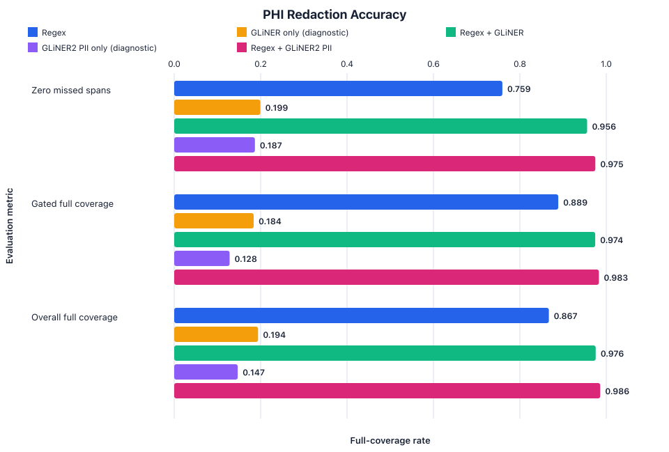

# PHI redaction benchmarking

<!-- Generated from every data/deid-eval/scorecard.*.json snapshot. Do not hand-edit. -->

## Executive summary

AutoCAB combines mandatory pattern matching with optional local named entity recognition (NER) models to detect text that may contain protected health information (PHI) or other personally identifiable information (PII). On the committed synthetic corpus, the additive configurations improve complete-span coverage and reduce records containing at least one missed identifier. The model-only configurations perform poorly and remain diagnostic controls, not production modes.

These measurements are regression evidence for AutoCAB's text detector. They do not establish clinical performance, HIPAA Safe Harbor compliance, or end-to-end system security.



## Benchmark objective

The benchmark measures whether each detector completely rewrites labelled synthetic identifiers while preserving non-sensitive scientific and computational text. It also tests whether an NER layer adds contextual coverage without replacing the mandatory pattern-based floor.

## Methods

The deterministic corpus has fingerprint `ccfbf64eb85ed302` and contains 316 records with 572 labelled spans across shell, OCR, notes, agent, diff, job, and pre-scrubbed channels. The labelled text spans cover the HIPAA identifier categories represented by the text detector, plus workflow-specific sensitive identifiers such as sample IDs, accessions, and Slurm job names. Values are synthetic and generated from reserved ranges or independently sampled public-domain lexicons.

Five configurations are compared: regex alone; two model-only diagnostic controls; and two production configurations in which regex runs before GLiNER or GLiNER2 PII. The tested GLiNER2 PII configuration requests only `person` at a 0.97 threshold because broader PII prompts increased false positives without improving additive redaction.

Full-coverage recall counts a gold span only when every character is rewritten. Partial overlap remains a missed span. The gated result uses the easy and medium tiers. Records with zero missed spans is the fraction of records with no full-coverage miss. Missed spans per 1,000 records scales the total number of full-coverage misses by the corpus record count. Over-redaction is measured against all corpus characters and protected `must_survive` terms.

## Results

### Headline comparison

| Metric | Regex | GLiNER only (diagnostic) | Regex + GLiNER | GLiNER2 PII only (diagnostic) | Regex + GLiNER2 PII |
| --- | ---: | ---: | ---: | ---: | ---: |
| Records with zero missed spans | 0.7595 | 0.1994 | 0.9557 | 0.1867 | 0.9747 |
| Missed spans per 1,000 records | 240.51 | 1458.86 | 44.30 | 1544.30 | 25.32 |
| Full-coverage recall, gated | 0.8889 | 0.1838 | 0.9744 | 0.1282 | 0.9829 |
| Full-coverage recall, all | 0.8671 | 0.1941 | 0.9755 | 0.1469 | 0.9860 |
| Over-redaction rate | 0.0043 | 0.0065 | 0.0055 | 0.0005 | 0.0048 |

`Regex + GLiNER` is additive: the regex rules always run, then GLiNER adds contextual findings.
`GLiNER only` is a diagnostic evaluation mode. It is not available for production capture or sealing.
`Regex + GLiNER2 PII` is a supported local sealing choice. The model-only mode is diagnostic and does not bypass the production regex floor.

## Improvement since v0.2

The historical comparison uses the committed v0.2 regex scorecard and the same synthetic corpus fingerprint as v0.3. The v0.3 regex column is included because the pattern rules also changed between releases.

| Metric | v0.2 regex | v0.3 regex | v0.3 Regex + GLiNER | v0.3 Regex + GLiNER2 PII |
| --- | ---: | ---: | ---: | ---: |
| Records with zero missed spans | 0.7468 | 0.7595 | 0.9557 | 0.9747 |
| Missed spans per 1,000 records | 253.16 | 240.51 | 44.30 | 25.32 |
| Full-coverage recall, all | 0.8601 | 0.8671 | 0.9755 | 0.9860 |
| Name recall, gated | 0.4500 | 0.4500 | 0.9500 | 0.9500 |
| Name recall, all | 0.3462 | 0.3462 | 0.9423 | 0.9615 |

On this corpus, the principal NER contribution is contextual name detection: gated name recall increases from 0.4500 with v0.3 regex alone to 0.9500 with either additive model. GLiNER2 PII also improves `SLURM_JOB_NAME` recall relative to the other production configurations.

### Recall by label

| Label | Regex | GLiNER only (diagnostic) | Regex + GLiNER | GLiNER2 PII only (diagnostic) | Regex + GLiNER2 PII |
| --- | ---: | ---: | ---: | ---: | ---: |
| `ACCESSION` | 1.0000 | 0.0000 | 1.0000 | 0.0000 | 1.0000 |
| `ACCOUNT` | 1.0000 | 0.0000 | 1.0000 | 0.0000 | 1.0000 |
| `AGE_OVER_89` | 1.0000 | 0.0000 | 1.0000 | 0.0000 | 1.0000 |
| `DATE_BARE` | 1.0000 | 0.1500 | 1.0000 | 0.0000 | 1.0000 |
| `DEVICE` | 1.0000 | 0.0000 | 1.0000 | 0.0000 | 1.0000 |
| `DOB_LABELLED` | 1.0000 | 0.2500 | 1.0000 | 0.0000 | 1.0000 |
| `EMAIL` | 1.0000 | 0.0000 | 1.0000 | 0.0938 | 1.0000 |
| `HEALTH_PLAN_ID` | 1.0000 | 0.0000 | 1.0000 | 0.0000 | 1.0000 |
| `IP` | 1.0000 | 0.0000 | 1.0000 | 0.0000 | 1.0000 |
| `LICENSE` | 1.0000 | 0.5000 | 1.0000 | 0.0000 | 1.0000 |
| `LOCATION` | 1.0000 | 0.3333 | 1.0000 | 0.0000 | 1.0000 |
| `MRN` | 1.0000 | 0.3750 | 1.0000 | 0.0000 | 1.0000 |
| `NAME` | 0.4500 | 0.5500 | 0.9500 | 0.5750 | 0.9500 |
| `PHONE` | 1.0000 | 0.1000 | 1.0000 | 0.0000 | 1.0000 |
| `SAMPLE_ID` | 1.0000 | 0.0000 | 1.0000 | 0.0000 | 1.0000 |
| `SLURM_JOB_NAME` | 0.7500 | 0.0312 | 0.7500 | 0.3438 | 0.8750 |
| `SSN` | 1.0000 | 0.0000 | 1.0000 | 0.0000 | 1.0000 |
| `SUBJECT_ID` | 1.0000 | 0.0312 | 1.0000 | 0.0000 | 1.0000 |
| `URL` | 1.0000 | 0.0000 | 1.0000 | 0.0000 | 1.0000 |

### Recall by channel

| Channel | Regex | GLiNER only (diagnostic) | Regex + GLiNER | GLiNER2 PII only (diagnostic) | Regex + GLiNER2 PII |
| --- | ---: | ---: | ---: | ---: | ---: |
| `agents` | 0.8571 | 0.1071 | 0.9286 | 0.0714 | 0.9286 |
| `diffs` | 0.8667 | 0.1167 | 0.9833 | 0.1500 | 1.0000 |
| `jobs` | 0.8333 | 0.1250 | 0.9167 | 0.1771 | 0.9583 |
| `notes` | 0.8462 | 0.3462 | 0.9936 | 0.1795 | 1.0000 |
| `ocr` | 0.8276 | 0.2155 | 1.0000 | 0.2069 | 1.0000 |
| `prescrubbed` | 1.0000 | 0.0000 | 1.0000 | 0.0000 | 1.0000 |
| `shell` | 1.0000 | 0.1094 | 1.0000 | 0.0312 | 1.0000 |

### Remaining full-coverage misses

| Label | Regex | GLiNER only (diagnostic) | Regex + GLiNER | GLiNER2 PII only (diagnostic) | Regex + GLiNER2 PII |
| --- | ---: | ---: | ---: | ---: | ---: |
| `ACCESSION` | 0 | 8 | 0 | 8 | 0 |
| `ACCOUNT` | 0 | 4 | 0 | 4 | 0 |
| `AGE_OVER_89` | 0 | 8 | 0 | 8 | 0 |
| `DATE_BARE` | 0 | 34 | 0 | 40 | 0 |
| `DEVICE` | 0 | 4 | 0 | 4 | 0 |
| `DOB_LABELLED` | 0 | 24 | 0 | 28 | 0 |
| `EMAIL` | 0 | 32 | 0 | 29 | 0 |
| `FAX` | 0 | 4 | 0 | 4 | 0 |
| `HEALTH_PLAN_ID` | 0 | 8 | 0 | 8 | 0 |
| `IP` | 0 | 24 | 0 | 24 | 0 |
| `LICENSE` | 0 | 4 | 0 | 8 | 0 |
| `LOCATION` | 0 | 24 | 0 | 32 | 0 |
| `MRN` | 0 | 58 | 0 | 76 | 0 |
| `NAME` | 68 | 38 | 6 | 34 | 4 |
| `PHONE` | 0 | 18 | 0 | 20 | 0 |
| `SAMPLE_ID` | 0 | 24 | 0 | 24 | 0 |
| `SLURM_JOB_NAME` | 8 | 35 | 8 | 25 | 4 |
| `SSN` | 0 | 20 | 0 | 20 | 0 |
| `SUBJECT_ID` | 0 | 62 | 0 | 64 | 0 |
| `URL` | 0 | 28 | 0 | 28 | 0 |

## Interpretation

The model-only controls show that neither NER model should replace deterministic patterns for structured identifiers. Their value is additive. In this corpus, most of the gain comes from contextual person-name detection, while regex retains coverage for MRNs, dates, account numbers, network addresses, and other structured forms.

These results compare detector configurations on one internal synthetic corpus. They do not demonstrate that the same ranking or error rates will hold for external clinical text, noisier OCR, or institution-specific identifiers.

## Runtime benchmarking

Runtime is not committed in scorecards because it depends on the machine. Measure model load separately from warmed inference:

```bash
autocab deid benchmark --engine regex --engine gliner-only --engine gliner \
  --output benchmark.json --plot benchmark-performance.svg
autocab deid benchmark --engine gliner2-pii-only --engine gliner2-pii
```

The command warms each loaded engine once, then reports seven runs by default: median and p95 ms/KB, median records/second, peak process memory, and machine/model provenance.

## Limitations and security boundaries

- The corpus is synthetic. It does not establish performance on external clinical corpora.
- A text detector does not remove faces or identifiers embedded only in images.
- These measurements are not a HIPAA Safe Harbor determination.
- The scorecards measure the detector, not storage, key handling, or operator behavior.
- Thresholds are regression controls, not claims that missed identifiers are acceptable.

## Reproduction

Install the optional local model runtime before reproducing all five detector configurations. The two fetch commands require network access and store verified model weights locally. Evaluation does not require network access after the weights are available. The final image conversion requires `rsvg-convert`.

```bash
uv sync --extra deid-gliner2
autocab deid fetch --model gliner
autocab deid fetch --model gliner2-pii
autocab deid gen-corpus --seed 1337 --check
autocab deid eval --engine regex --write-scorecard --check-thresholds
autocab deid eval --engine gliner-only --write-scorecard
autocab deid eval --engine gliner --write-scorecard --check-thresholds
autocab deid eval --engine gliner2-pii-only --write-scorecard
autocab deid eval --engine gliner2-pii --write-scorecard
rsvg-convert docs/figures/phi-redaction-accuracy.svg \
  --output docs/figures/phi-redaction-accuracy.png
```

The corpus check should report:

```text
OK Corpus reproduces byte-for-byte: 316 records, fingerprint ccfbf64eb85ed302
```

Each evaluation command writes its engine scorecard and rebuilds this report and the canonical SVG. The final command creates the PNG shown above. Runtime results are intentionally written to a separate machine-specific benchmark file rather than committed scorecards.

## References

- Zaratiana U, Tomeh N, Holat P, Charnois T. GLiNER: Generalist Model for Named Entity Recognition using Bidirectional Transformer. NAACL 2024:5364-5376. https://doi.org/10.18653/v1/2024.naacl-long.300
- Zaratiana U, Lewis A, Hurn-Maloney G. GLiNER2-PII: A Multilingual Model for Personally Identifiable Information Extraction. arXiv:2605.09973 (2026). https://arxiv.org/abs/2605.09973
