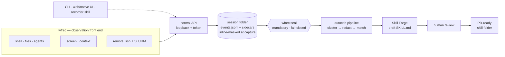

# Architecture

Two halves, one contract

---
layout: default
---

<div class="kicker">Architecture</div>

# The system map



<div class="text-sm mt-2 opacity-75">
Left half produces evidence, right half consumes it, and the diamond is the only
door between them. Three faces, one API — a click, a command and a sentence do
the same thing.
</div>

<!--
Read it left to right. The left half produces evidence, the right half consumes
it, and the diamond in the middle is the only door between them. The dotted
lines at the bottom are the point of the next slide: three different faces, one
API, so a click and a command do the same thing.
-->

---
layout: two-cols-header
---

<div class="kicker">Architecture</div>

# Two halves that never reach around each other

::left::

**`src/wfrec/` — produces evidence**

<div class="text-sm opacity-85">

- Owns the active session and its collectors
- One backend per source, each degrading with a **named reason**
- Append-only timeline; a sealed session refuses further appends
- Four faces of one control API: `cli.py`, `daemon.py`, `api.py`, `ui/`

</div>

```bash
wfrec doctor        # which backend resolved, and why
wfrec start --title "HG008 variant QC" --watch .
wfrec source screen on
wfrec note "reran because the BAM was truncated" --label why
wfrec stop && wfrec seal <id>
```

::right::

**`src/autocab/` — consumes it under contract**

<div class="text-sm opacity-85">

- Six `Protocol` interfaces, each independently swappable
- `InputAdapter` · `Clusterer` · `Redactor` · `ProposalBuilder` · `ReviewService` · `Exporter`
- `PipelineContext` captures one end-to-end run for audit
- Defaults are deliberately simple so the seams stay visible

</div>

```bash
autocab demo --input-mode session \
  --session-dir ~/.wfrec/sessions/<id>
autocab deid eval --write-scorecard
```

::bottom::

<div class="mt-4 claim text-sm">
The recorder never imports the pipeline and the pipeline never imports the
recorder. They meet at a session folder on disk, which is why a session zips up
and moves between machines unchanged.
</div>

<!--
The protocol boundary is what makes this a framework and not a demo script.
Swapping keyword matching for embeddings, or the in-memory review queue for a
real service, is a one-class change with the rest of the pipeline untouched.
-->

---
layout: default
---

<div class="kicker">Architecture · observation</div>

# Five sources, independently toggleable

| Source | Captures | Backend reality |
|---|---|---|
| `shell` | Commands, cwd, exit codes, durations | DevSQL with Atuin primary; installed hooks are the fallback. **stdout/stderr are not captured** |
| `files` | Git-verified changes and diffs in declared roots | `watchdog` triggers, `git` verifies. Genomics binaries stay metadata-only — never opened |
| `agents` | Codex, Claude Code, Copilot Chat, Cursor transcripts | Codex via DevSQL, Claude Code via local JSONL; `attach-transcript` is the manual fallback |
| `screen` | Frames, OCR text, active-window titles, optional video | OCR is the part a model can read; video is for humans |
| `context` | The paste box and `wfrec note` | Deliberate by construction — **no background clipboard watching** |

<div class="grid grid-cols-2 gap-6 mt-6 text-sm">
<div v-click>

**Toggles reach terminals that are already open.**
`wfrec source shell off` takes effect at the next prompt in every live shell —
no restart, no re-sourcing. "Stop logging my bash history" is one sentence to
the agent skill and it is honored immediately.

</div>
<div v-click>

**Pause carries a reason.**
`wfrec pause --reason "waiting on bwa" --expect 6h` is what lets a downstream
skill distinguish *"the analyst waited six hours on an alignment"* from
*"nothing happened"*. A pause without a reason throws that signal away.

</div>
</div>

<!--
The toggle story is the consent story. Nobody trusts a recorder they cannot
stop, and "stop it in the terminal I am already sitting in" is the version of
stopping that people actually need.
-->

---
layout: two-cols
---

<div class="kicker">Architecture · the artifact</div>

# The session folder is the source of truth

```text
~/.wfrec/sessions/<id>/
├── manifest.json   title, analyst, host,
│                   lifecycle log, toggle history
├── events.jsonl    the verbose timeline
├── screen/         frames, ocr text, video
├── shell/          DevSQL cursor, remote spools
├── agents/         transcript captures
├── files/          change events and diffs
├── context/        pasted notes
├── jobs/           slurm slices and accounting
├── deid/           audit.jsonl — labels and
│                   offsets, never values
└── exports/        lossy projections
```

::right::

<div class="text-sm mt-14">

**Append-ordered by `seq`, which is not chronological.**
A shell hook stamps a command the instant it finishes; the daemon ingests it up
to a second later. Sort by `(ts, seq)` — `EventWriter.read_sorted()` does, and
so does every exporter.

<div class="mt-4">

**Hooks write to disk, never to the daemon.**
That single decision is why capture survives a daemon restart, a crashed UI, and
a login node that rebooted: the shell's side of the contract is a file append.

</div>

<div class="mt-4">

**Self-contained and movable.**
Zip one and hand it to a teammate. `wfrec merge` folds several analysts'
sessions together and reports which workflow families **more than one person
performed** — the highest-value skill-candidate signal in the system.

</div>

</div>

<!--
Multi-analyst agreement is the quiet best feature. One person doing something
twice is a habit. Three people doing it independently is a skill worth
publishing, and merge is what surfaces that difference.
-->

---
layout: default
---

<div class="kicker">Architecture · the seam</div>

# The exporters are deliberately lossy — on purpose

<div class="grid grid-cols-2 gap-8 mt-4">
<div>

| Format | Consumed by |
|---|---|
| `autocab-terminal.log` | `terminal_logs.convert_terminal_log` |
| `autocab-screen-capture.json` | `input_sources.load_screen_capture_input` |
| `trace.json` | `demo_data.load_workflow_traces` |

<div class="mt-5 text-sm">

`autocab.models.WorkflowStep` has exactly four fields — `timestamp`, `tool`,
`action`, `detail`. Exit codes, durations, diffs and OCR collapse into `detail`
or are dropped.

</div>

</div>
<div>

<div class="claim text-sm">
The rule the codebase enforces on itself: <strong>do not widen
<code>WorkflowStep</code> to fit the recorder.</strong> The timeline stays the
source of truth and the export stays a projection.
</div>

<div class="mt-6 text-sm">

**So you can skip export entirely.**

```bash
autocab demo --input-mode session \
  --session-dir ~/.wfrec/sessions/<id>
```

`--input-mode session` reads the session folder directly and rebuilds from the
live timeline rather than trusting a possibly-stale export. Skill Forge takes
this path.

</div>

</div>
</div>

<!--
This is the architectural discipline worth calling out to engineers in the room:
three adapters were written to fit code that already existed, rather than
rewriting four modules to fit the new component. That is why the recorder landed
without breaking the pipeline.
-->
